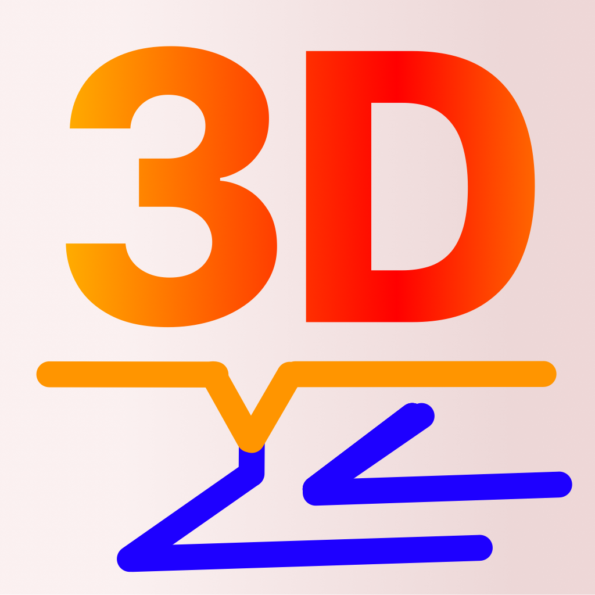

# Print To 3D - Slice your design to gcode

Finally, 3D printing comes to iPad !

Right from the start, with an awesome, native UI for the incredible M1 iPads. In just a few moments, you can slice your 3D design, upload the gcode to your 3D printer (e.g. powered by Octoprint) and your print can start. An excellent companion for your 3D design app like Modeler 3D.

Move, rotate and zoom your models. Select your 3D printer from an extensive list, tune the slicing process with an outstanding amount of settings. Analyze the slicing results for fill pattern, support, rafts, number of shells and much more.

Selection of features:
- 44 FDM 3D printers supported
- Load (binary) STL- and OBJ-Files
- Can define pre/post printing G-Code commands - specific for your printer
- Modify the default printer settings as per your needs
- Upload your gcode file directly to your octoprint server
- Full control of the slicing process
- Supports hex, grid, linear, triangle, gyroid, vase infills
- Supports brim/raft/number of shells, top/bottom layers....
- Easy setting of nozzle and bed temperature
- Specialized settings available for the critical first layer.
- and, and, and...

Follow us on Twitter: [@PrintTo3D](https://www.twitter.com/PrintTo3D)

